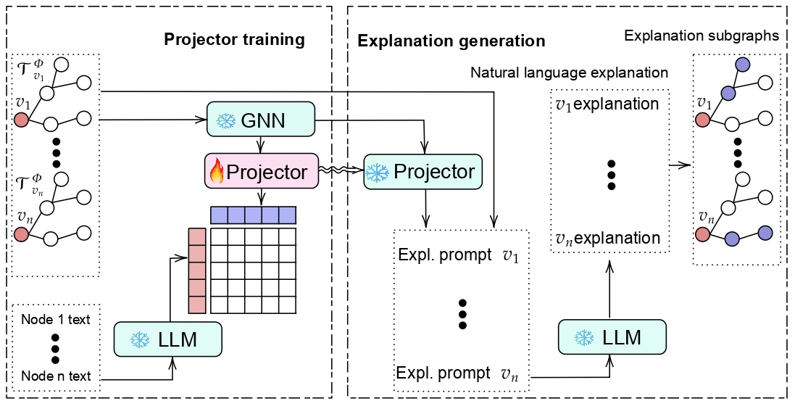

# From Nodes to Narratives: Explaining Graph Neural Networks with LLMs and Graph Context

This repository is a reference implementation of the Language guided explainer from the paper:

[From Nodes to Narratives: Explaining Graph Neural Networks with LLMs and Graph Context](https://arxiv.org/abs/2508.07117)



## Requirements

Please use the script `installation.sh` to install the requirements as follows:

```
chmod +x installation.sh
./installation.sh
```

We ran our experiments on NVIDIA-GeForce-RTX-3090 GPUs with 32GB RAM.

## How to Use

### Training from scratch:
Below is the instruction to use the code for training an evaluating the models from scratch.

1. Export you huggingface token: use the command `export HUGGINGFACE_TOKEN="your token"` to set your huggingface tokens. 
2. Make the script `run.sh` executable as `chmod +x run.sh`. 
3. Edit the appropriate arguments for a desired experiments in script `run.sh`. You must give the path to a config, e.g. `-cff ./config/amazon_products.yaml`. You would also alter the arguments directly in from the config files stores in the `config` directory. Find the full set of arguments in `main.py`.

### Reproducibility:
All the pretrained models and required data files for GCN as the pretrained GNN are accessible from [THIS LINK](https://drive.google.com/file/d/18fb80U0An8fTnmgL_oNFCKZCAcsvUzKC/view?usp=sharing). Please download, unzip and put the `pretrained` and `output` directories in the main code's execution path. 

You can run the following code directly or copy and paste to file `run.sh` and run that script.

```
python main.py -cff "./config/amazon_products.yaml" -m gspell -adp \
-pdp ./output/products-meta-llama/data.pth \
-pgp ./pretrained/products-meta-llama/gcn.pth \
-ppp ./pretrained/products-meta-llama/projector.pth
```

## What is supported

### Datasets: 
The current code support the following datasets. Use `-cff` with:

Dataset | path |
:--- | :---: |
Amazon Products | ```./config/amazon_products.yaml``` |
Cora | ```./config/cora.yaml``` |
Liar | ```./config/liar.yaml``` |
WikiCS | ```./config/wikics.yaml``` |

### Methods: 
The current code support the Amazon datasets. We add the codes for other datasets soon. Use `-m` with:

Dataset | path |
:--- | :---: |
GSPELL | `gspell` |
GNNExplainer | `gnnexplainer` |
PGExplainer | `pgexplainer` |
TAGExplainer | `tage` |
Node | `node` |
Random | `random` |
LLM | `llm` |

### GNN architectures:
We support four common GNN architectures. Use `-gt`

Architecture | path |
:--- | :---: |
GCN | `gcn` |
GAT | `gat` |
GIN | `gin` |
GraphSAGE | `sage` |

### LLM models:
We support a set of common pretrained LLMs. Use `-lm`

Architecture | path |
:--- | :---: |
Llama 3.1 8B Instruct | `meta-llama/Meta-Llama-3.1-8B-Instruct` |
Llama 2 7B Chat | `meta-llama/Llama-2-7b-chat-hf` |
GPT-2 | `openai-community/gpt2` |
Mistral 7B Instruct v0.2 | `mistralai/Mistral-7B-Instruct-v0.2` |
Pythia 2.8B | `EleutherAI/pythia-2.8b` |
GPT-Neo 2.7B | `EleutherAI/gpt-neo-2.7B` |
Phi-3 Mini 4k Instruct | `microsoft/Phi-3-mini-4k-instruct` |
